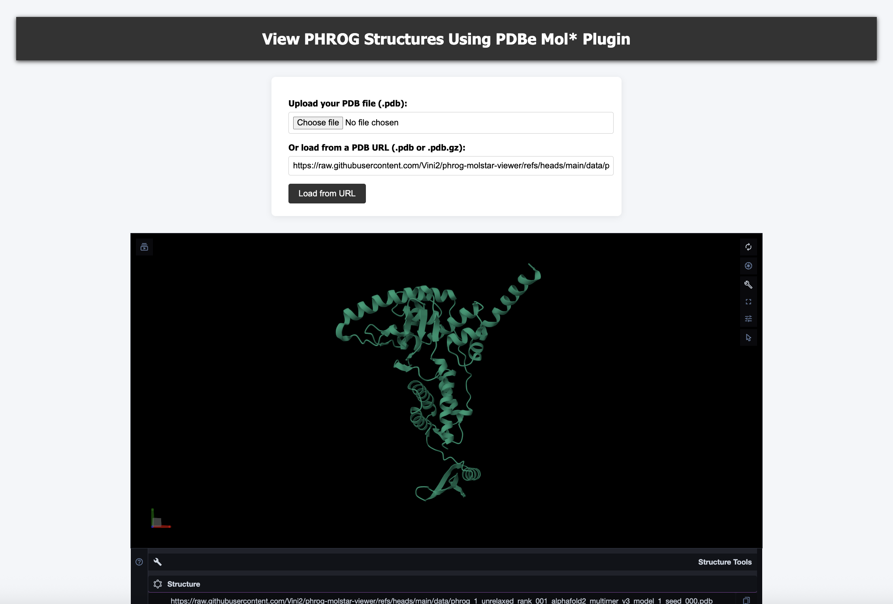

# PHROG Mol* Viewer

This website was created to view structures for representatives of all the PHROG protein clusters available from [https://linsalrob.github.io/PHROG_structures/](https://linsalrob.github.io/PHROG_structures/).

Check out the website **[vini2.github.io/phrog-molstar-viewer/](https://vini2.github.io/phrog-molstar-viewer/)**.

  

You can upload your own `.pdb` file or provide a URL to a `.pdb` or gzipped `.pdb` file (`.pdb.gz`). You can test using the sample data provided in the [data](https://github.com/Vini2/phrog-molstar-viewer/tree/main/data) folder.

Please check the [GitHub repo](https://github.com/linsalrob/PHROG_structures/) if you want to download the raw data of the structures.